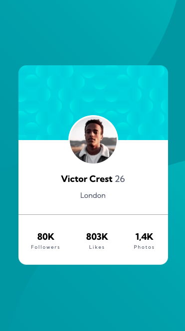

# Frontend Mentor - Profile card component solution

This is a solution to the [Profile card component challenge on Frontend Mentor](https://www.frontendmentor.io/challenges/profile-card-component-cfArpWshJ). Frontend Mentor challenges help you improve your coding skills by building realistic projects. 

## Table of contents

- [Overview](#overview)
  - [The challenge](#the-challenge)
  - [Screenshot](#screenshot)
  - [Links](#links)
- [My process](#my-process)
  - [Built with](#built-with)
  - [What I learned](#what-i-learned)
  - [Useful resources](#useful-resources)

### The challenge

- this project was made only with one media-querie (min.width:700px).

### Screenshot

### Links

- Solution URL: https://github.com/marcos-ortiz-osca/front-mentor-03.git
- Live Site URL: https://marcos-ortiz-osca.github.io/front-mentor-03/

## My process

### Built with

- Semantic HTML5 markup
- CSS 
- Flexbox
- Mobile-first workflow

### What I learned

positioning img in background

### Useful resources

https://css-tricks.com/almanac/properties/b/background/